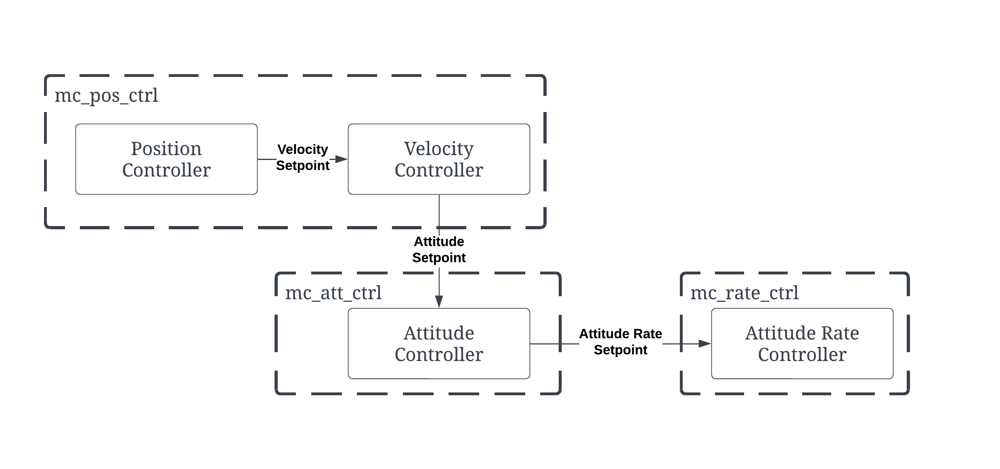

# DTRG horizontal thrust (HT) mode

On a fully actuated multirotor the rotors can push sideways as well as up. Horizontal thrust (HT) mode uses that: while an RC switch is on, the vehicle moves horizontally with **body-frame X/Y thrust instead of tilting**. Its roll and pitch are free to be commanded separately: level by default, or set by two aux RC channels or by offboard.

This page covers HT in every mode that supports it: Stabilized and Manual,
where the sticks command thrust directly ("level mode"), and the modes run by
the position controller (Altitude, Position, Offboard, Hold, Mission, ...). The
setup, parameters and thrust limit are shared; the modes differ in
[usage](#4-usage) and [maths](#5-the-maths).

| | |
| --- | --- |
| Parameters | `DTRG_HT_EN`, `RC_MAP_HT_MODE`, `RC_MAP_HT_ROLL`, `RC_MAP_HT_PITCH`, `DTRG_HT_MAX`, `DTRG_HT_R_MAX`, `DTRG_HT_P_MAX`, `DTRG_HT_MASK`, `DTRG_HT_SPLIT_EN`, `DTRG_HT_SPLIT` (group *DTRG Horizontal Thrust*), and the upstream `MPC_MAN_TILT_MAX`, `MC_MAN_TILT_TAU` (Stabilized) |
| Code | `src/lib/dtrg_horizontal_thrust/dtrg_horizontal_thrust.hpp` (all the logic), `src/modules/mc_pos_control/MulticopterPositionControl.cpp`, `MulticopterAttitudeControl::generate_attitude_setpoint()` in `src/modules/mc_att_control/mc_att_control_main.cpp`, parameters in `src/modules/mc_pos_control/multicopter_horizontal_thrust_params.c` |
| uORB | `horizontal_thrust_limit` (logged) |
| Tests | `DtrgHorizontalThrustTest.cpp`, `DtrgHorizontalThrustSplitTest.cpp` (tier 1), `test_horizontal_thrust.py` (tier 2), `test_flight_ht.py` (tier 3) |

> **Safety:** HT only makes sense on a vehicle whose geometry can produce X/Y
> thrust (`CA_ROTORn_AX/AY` not all zero). On a normal multirotor the
> allocator drops the X/Y thrust, so with HT on the vehicle can no longer
> move horizontally. Try HT in [SITL](DTRG_Planar_Octo_SITL.md) first, and
> fly it first in Position mode with a low `DTRG_HT_MAX`. In Stabilized
> nothing holds position: with HT on and the knobs centred, a level vehicle
> has nothing pulling it back, and the sticks command thrust (acceleration),
> not tilt.

---

## 1. What it does

Without HT, a multirotor produces horizontal force by tilting: the position
controller (or, in Stabilized, the sticks) sets an attitude whose body Z axis
points along the desired thrust, with all the thrust on body Z.

With HT on, on the axes selected by `DTRG_HT_MASK`, the attitude no longer
follows the desired thrust. It comes from somewhere else (level, the aux
channels or offboard), and the horizontal part of the thrust becomes body X/Y
thrust, which the control allocator gives to the tilted rotors.

When the switch is off, or `DTRG_HT_EN = 0`, PX4 behaves exactly as upstream.

### Where HT acts

| Flight mode | HT handled by | Sticks command | Tilt on the HT axes from | Usage |
| --- | --- | --- | --- | --- |
| Manual, Stabilized | `mc_att_control` | X/Y thrust directly | aux channels | [4.1](#41-stabilized-and-manual-level-mode) |
| Altitude, Position, Hold, Mission, Takeoff, Land, RTL | `mc_pos_control` | what the mode normally does (velocity, ...) | aux channels | [4.2](#42-position-controlled-modes) |
| Offboard (position / velocity / acceleration setpoints) | `mc_pos_control` | — | `DEBUG_FLOAT_ARRAY` from the companion | [4.3](#43-offboard-commanding-the-tilt) |
| Acro, Offboard with attitude/rate/thrust setpoints | — | no HT | — | |

The HT switch is an RC channel, so **HT needs RC even in Offboard**: the
companion computer cannot switch it on.

---

## 2. Setup

1. Use an airframe with a fully actuated geometry, for example
   `12013_dtrg_planar_octo` (sets `DTRG_HT_EN 1`, `RC_MAP_HT_MODE 8`).
2. Set the parameters:
	-   DTRG_HT_EN → Enabled (1)
	-   RC_MAP_HT_MODE  → Choose Channel to use
3. Reboot
4. Put the HT switch on a two-position switch, and the tilt channels on
   centred knobs or sliders.
5. Use channels that no other `RC_MAP_*` uses: arming is refused otherwise
   (see [RC channel conflict check](DTRG_RC_Channel_Conflict_Check.md)).

### RC conventions

| Input | Reads | Value | Effect |
| --- | --- | --- | --- |
| `RC_MAP_HT_MODE` | `rc_channels` (calibrated, `[-1, 1]`) | $> 0.5$ (PWM ≳ 1750 µs with default calibration) | HT on |
| `RC_MAP_HT_ROLL` | `rc_channels` | $r \in [-1, 1]$, dead zone $\pm 0.02$ | roll $= r \cdot$ `DTRG_HT_R_MAX`, + = right side down |
| `RC_MAP_HT_PITCH` | `rc_channels` | $p \in [-1, 1]$, dead zone $\pm 0.02$ | pitch $= p \cdot$ `DTRG_HT_P_MAX`, + = nose up |

An unassigned (0) aux channel commands 0 (level). A non-finite value
(RC lost) also reads as 0.

---

## 3. Parameters

| Parameter          | Description                                                                                                                                                                                               |
| ------------------ | --------------------------------------------------------------------------------------------------------------------------------------------------------------------------------------------------------- |
| `DTRG_HT_EN`       | Enables the feature. With 0 (False) nothing below is read.                                                                                                                                                |
| `RC_MAP_HT_MODE`   | RC channel of the HT switch. HT is on while it reads above 0.5. 0 = no switch, HT never on. Can be the arm switch's channel if the vehicle should always fly in HT, but no other `RC_MAP_*` can share it. |
| `RC_MAP_HT_ROLL`   | RC channel commanding the roll tilt on HT axes. 0 = level.                                                                                                                                                |
| `RC_MAP_HT_PITCH`  | RC channel commanding the pitch tilt on HT axes. 0 = level.                                                                                                                                               |
| `DTRG_HT_MAX`      | Limit on the body X and Y thrust, each axis separately, in normalised thrust (the unit of `vehicle_thrust_setpoint`, like the vertical thrust). See [HT thrust limit](#54-ht-thrust-limit-dtrg_ht_max).   |
| `DTRG_HT_R_MAX`    | Roll tilt at full aux deflection, and the limit on the offboard roll.                                                                                                                                     |
| `DTRG_HT_P_MAX`    | Pitch tilt at full aux deflection, and the limit on the offboard pitch.                                                                                                                                   |
| `DTRG_HT_MASK`     | Which body axes move by horizontal thrust (below).                                                                                                                                                        |
| `DTRG_HT_SPLIT_EN` | 0: the HT axes move by horizontal thrust only.  1: they move by horizontal thrust *and* tilting, shared by `DTRG_HT_SPLIT`.                                                                            |
| `DTRG_HT_SPLIT`    | With the split on, the share produced by horizontal thrust: 1 = all thrust (no tilt), 0 = all tilt (no HT).                                                                                               |

In Manual, the upstream `MPC_MAN_TILT_MAX` (stick tilt, and the limit on
the knob tilt) and `MC_MAN_TILT_TAU` (tilt filter) also apply.

### `DTRG_HT_MASK` and the split

| `DTRG_HT_MASK` | Body X (forward) | Body Y (right) |
| --- | --- | --- |
| 0 | HT | HT |
| 1 | HT | tilt (roll), normal controller |
| 2 | tilt (pitch), normal controller | HT |

On an **HT axis**:

| `DTRG_HT_SPLIT_EN` | Movement | Tilt on that axis |
| --- | --- | --- |
| 0 | horizontal thrust only | aux channel or offboard (level if unassigned) |
| 1 | `DTRG_HT_SPLIT` × horizontal thrust + (1 − `DTRG_HT_SPLIT`) × tilting | from the controller or stick (aux channels and offboard tilt are ignored on that axis) |

On a **non-HT axis** the vehicle tilts as usual and the horizontal thrust on
that axis is 0.

Use mask 1 or 2 when one axis has much less HT authority than the other, or to
fly one axis like a normal multirotor. Use the split to keep some tilt, which
needs less motor effort than pure HT (HT costs vertical thrust headroom, see
[Sequential desaturation](DTRG_Sequential_Desaturation.md)).

---

## 4. Usage

### 4.1 Stabilized and Manual (level mode)

With the HT switch on, the roll and pitch sticks no longer tilt the vehicle.
They command body-frame forward and sideways **thrust** directly, and the
vehicle stays level. The aux channels set the roll and pitch tilt
independently of the motion.

| | Switch off (upstream) | Switch on, `DTRG_HT_SPLIT_EN = 0` | Switch on, `DTRG_HT_SPLIT_EN = 1` |
| --- | --- | --- | --- |
| Pitch stick | pitch tilt up to `MPC_MAN_TILT_MAX` | body X thrust up to `DTRG_HT_MAX` | $s$ × body X thrust + $(1-s)$ × pitch tilt |
| Roll stick | roll tilt up to `MPC_MAN_TILT_MAX` | body Y thrust up to `DTRG_HT_MAX` | $s$ × body Y thrust + $(1-s)$ × roll tilt |
| HT pitch knob | — | pitch tilt up to `DTRG_HT_P_MAX` | ignored |
| HT roll knob | — | roll tilt up to `DTRG_HT_R_MAX` | ignored |
| Throttle, yaw | unchanged | unchanged | unchanged |

($s$ = `DTRG_HT_SPLIT`.) This table is for `DTRG_HT_MASK = 0`. With mask 1
only the pitch stick switches to thrust (roll stick still rolls); with mask 2
only the roll stick does (pitch stick still pitches).

Stick directions follow the usual convention: pitch stick forward → forward
(+X) thrust, roll stick right → rightward (+Y) thrust.

"Level mode": with the knobs unassigned or centred, flipping the HT switch
turns the vehicle into one that stays level and slides around under the
sticks.

To fly it:

1. Take off in Stabilized with HT off and the knobs centred.
2. Flip the HT switch on. Let the sticks go: the vehicle levels and drifts
   only with the wind. Push the pitch stick gently: it accelerates forward
   while staying level.
3. Turn a knob to tilt the vehicle on the spot (it stays where it is, apart
   from the thrust it now has along the tilt). The knob tilt is also limited
   by `MPC_MAN_TILT_MAX`.
4. Flip the switch off before landing, or land with it on: the vertical
   thrust (throttle) is the same either way.

### 4.2 Position-controlled modes

In Altitude, Position and the auto modes:

- the sticks, the position hold and the velocity limits work as usual;
- the vehicle stays level (or at the attitude commanded on the aux channels);
- the knobs (`RC_MAP_HT_ROLL` / `RC_MAP_HT_PITCH`) tilt the vehicle on the
  spot without it moving away: the position controller compensates with body
  X/Y thrust.

To fly it: take off in Position mode with HT off, then flip the switch. The
vehicle should stay where it is and level. Move the sticks: it should
translate without tilting.

### 4.3 Offboard: commanding the tilt

In Offboard with position, velocity or acceleration setpoints, the companion
computer commands the motion with `SET_POSITION_TARGET_LOCAL_NED` (or ROS 2
`TrajectorySetpoint`) as usual. With HT on, the roll and pitch on the HT axes
are read from the MAVLink message `DEBUG_FLOAT_ARRAY` (uORB `debug_array`):

| `data[]` | Meaning | Limit |
| --- | --- | --- |
| `data[0]` | roll [rad] | $\pm$ `DTRG_HT_R_MAX` |
| `data[1]` | pitch [rad] | $\pm$ `DTRG_HT_P_MAX` |

- The last values received are held until the next message. On entering
  Offboard, the tilt last commanded on the aux channels is held until the
  first message arrives.
- A NaN/inf value commands level (0).
- `name` and `array_id` are not checked: any `DEBUG_FLOAT_ARRAY` from any
  MAVLink source is used, so do not send other debug arrays to the vehicle.
- In the non-offboard modes the aux RC channels are used instead.

The [DTRG MAVLink dialect](DTRG_MAVLink_Dialect.md) also defines a
`DTRG_OFFBOARD` message for 6-DOF setpoints, but HT does not read it yet.

---

## 5. The maths

Common notation: $L$ = `DTRG_HT_MAX`, $s$ = `DTRG_HT_SPLIT`,
$s_{on}$ = `DTRG_HT_SPLIT_EN`, $\phi_{max}, \theta_{max}$ = `DTRG_HT_R_MAX`,
`DTRG_HT_P_MAX`, aux channels $r, p \in [-1, 1]$ (dead zone $\pm 0.02$).

### 5.1 Stabilized and Manual

Inputs: sticks $\delta_r, \delta_p \in [-1, 1]$ (right, forward positive),
throttle. $\Theta$ = `MPC_MAN_TILT_MAX`.

**Tilt.** On an HT axis:

$$
\phi = \begin{cases} (1-s)\,\delta_r\,\Theta & s_{on} \\ r\,\phi_{max} & \text{otherwise} \end{cases}
\qquad
\theta_{nose\,down} = \begin{cases} (1-s)\,\delta_p\,\Theta & s_{on} \\ -p\,\theta_{max} & \text{otherwise} \end{cases}
$$

On a non-HT axis the stick tilts as upstream: $\phi = \delta_r\Theta$,
$\theta_{nose\,down} = \delta_p\Theta$. After this the upstream path is
unchanged: the roll/pitch pair is low-pass filtered with `MC_MAN_TILT_TAU`,
its norm limited to $\Theta$, and combined with the yaw setpoint from the
yaw stick.

**Body thrust.** On an HT axis:

$$
T^B_x = \mathrm{clamp}\big(\delta_p\, L\, k,\ -L,\ L\big),\qquad
T^B_y = \mathrm{clamp}\big(\delta_r\, L\, k,\ -L,\ L\big),\qquad
k = \begin{cases} s & s_{on} \\ 1 & \text{otherwise}\end{cases}
$$

and 0 on a non-HT axis. The vertical thrust is the upstream throttle curve,
$T^B_z = -f_{thr}(\text{throttle})$. The three components go to the rate
controller and from there unchanged to the allocator as
`vehicle_thrust_setpoint`.

Unlike in the position-controlled modes, nothing rotates the thrust here: the
sticks command the body-frame thrust directly. A tilted vehicle (knob) with
the sticks centred therefore has a horizontal force from the tilt alone,
$\approx |T^B_z|\sin\phi$, and drifts that way.

### 5.2 Position controller, split off

The position controller outputs the thrust setpoint $T = [T_N, T_E, T_D]^T$ (NED, normalised) and the yaw setpoint $\psi$. The attitude controller is expecting an attitude setpoint $q_{sp}$. $R(\phi, \theta, \psi)$ rotates body FRD to NED.

1. **Tilt.** Per axis, take the HT tilt on HT axes and the controller's tilt
   on the others:

   $$
   \phi = \begin{cases} \phi_{HT} & \text{Y is an HT axis} \\ \phi_{ctrl} & \text{otherwise}\end{cases}
   \qquad
   \theta = \begin{cases} \theta_{HT} & \text{X is an HT axis} \\ \theta_{ctrl} & \text{otherwise}\end{cases}
   $$

   where $\phi_{ctrl}, \theta_{ctrl}$ are the roll and pitch of PX4's normal
   attitude setpoint (body Z along $-T$, see [7.2](#72-from-thrust-to-attitude-setpoint)), and $\phi_{HT}, \theta_{HT}$ come
   from the aux channels (or offboard):
   $$
   \phi_{HT} = \mathrm{clamp}(r \cdot \phi_{max}),\qquad
   \theta_{HT} = \mathrm{clamp}(p \cdot \theta_{max})
   $$

2. **Attitude setpoint.** $q_{sp} = q(\phi, \theta, \psi)$, yaw unchanged.

3. **Body thrust.** Express the whole thrust vector in that attitude:

   $$
   T^{B} = R(\phi, \theta, \psi)^T\, T
   $$

4. **Limit.** On HT axes, clamp to $\pm L$ ([5.4](#54-ht-thrust-limit-dtrg_ht_max));
   on the others, 0. $T^{B}_{z,sp} = T^B_z$.

With the vehicle level ($\phi = \theta = 0$) step 3 is just a rotation by yaw set:

$$
T^B_x = \cos\psi\, T_N + \sin\psi\, T_E,\qquad
T^B_y = -\sin\psi\, T_N + \cos\psi\, T_E,\qquad
T^B_z = T_D
$$

so the horizontal thrust the position controller asked for becomes body X/Y
thrust one to one.

### 5.3 Position controller, split on

The controller's horizontal thrust is split in the heading frame (forward $f$,
right $r$):

$$
\begin{bmatrix} f \\ r \end{bmatrix} =
\begin{bmatrix} \cos\psi & \sin\psi \\ -\sin\psi & \cos\psi \end{bmatrix}
\begin{bmatrix} T_N \\ T_E \end{bmatrix},
\qquad
f' = (1-s)\, f\ \text{(if X an HT axis)},\quad r' = (1-s)\, r\ \text{(Y an HT axis)}
$$

The attitude is computed by PX4's normal thrust-to-attitude from the reduced
vector $T' = [R_z(\psi)\,[f', r']^T,\ T_D]$, so the vehicle tilts for
$(1-s)$ of the horizontal thrust. The body thrust is then computed from the
**full** $T$ as in step 3. What the tilt does not produce is left over as body
X/Y thrust; for small angles

$$
T^B_x \approx s\, f,\qquad T^B_y \approx s\, r
$$

then clamped to $\pm L$ as in step 4.

### 5.4 HT thrust limit (`DTRG_HT_MAX`)

In every mode, before the allocator, the HT code caps the body X and Y thrust
to `DTRG_HT_MAX` (each axis separately, normalised thrust):

$$
T^{B}_{x,sp} = \begin{cases}\mathrm{clamp}(T^B_x, -L, L) & \text{X is an HT axis} \\ 0 \end{cases}
\qquad
T^{B}_{y,sp} = \begin{cases}\mathrm{clamp}(T^B_y, -L, L) & \text{Y is an HT axis} \\ 0 \end{cases}
$$

and publishes `horizontal_thrust_limit.x_sat` / `y_sat` = 1 while
$|T^{B}_{x,sp}| \ge L$ / $|T^{B}_{y,sp}| \ge L$. In Stabilized that is full
stick with `DTRG_HT_SPLIT_EN = 0`, and never with the split on and $s < 1$.

The cap does not guarantee that the motors can deliver the thrust: what is
actually given up when they cannot is decided by the allocator, see
[Sequential desaturation](DTRG_Sequential_Desaturation.md). The two limits
work together:

| | `DTRG_HT_MAX` | Sequential desaturation |
| --- | --- | --- |
| Where | `mc_pos_control` / `mc_att_control`, before the allocator | control allocator |
| Limits | X/Y thrust demand to a fixed value | X/Y thrust to what the motors can deliver right now, given the vertical thrust and the torques |
| Logged as | `horizontal_thrust_limit` | `sequential_desaturation.x_sat/y_sat` |

**Choosing `DTRG_HT_MAX`:** set it so that at hover the cap is reached before
the motors saturate. Fly (or simulate) full HT stick in each direction and
look at the log. If `sequential_desaturation.x_sat`/`y_sat` are non-zero while
`horizontal_thrust_limit` shows 0, the motors run out before the cap and the
cap can come down. If the cap is reached long before any desaturation, it can
go up. Remember that HT takes motor headroom from the vertical axis: the
heavier the vehicle (or the higher the climb rate), the less HT is available.

**In the position-controlled modes**, the clamp is applied after the position
controller, which does not know about it. If $L$ is too low for the requested
acceleration, the vehicle accelerates less than asked and the velocity
integrator winds up; when HT is switched off the stored integral comes out as
a tilt. Watch `horizontal_thrust_limit` (and the sequential desaturation
gains) in the log.

---

## 6. Logging

| Topic | Field | |
| --- | --- | --- |
| `horizontal_thrust_limit` | `x_sat`, `y_sat` | 1 while the body X / Y thrust is at `DTRG_HT_MAX`. Published only while HT is on. |
| `vehicle_attitude_setpoint` | `thrust_body[0..1]` | the commanded body X/Y thrust |
| `vehicle_thrust_setpoint` | `xyz` | what the allocator receives |
| `sequential_desaturation`, `dtrg_desaturated_control` | | what the allocator gave up, see [Sequential desaturation](DTRG_Sequential_Desaturation.md) |
| `rc_channels` | `channels[RC_MAP_HT_* - 1]` | the switch and the knobs |

---

## 7. Notes: the PX4 controllers HT sits in

Background on the upstream multicopter controllers, to show where HT changes
the signal path and what it leaves alone. Gains are the upstream parameters;
HT does not change any of them.

In Stabilized there is no position controller: the sticks give the attitude
and thrust setpoint directly ([5.1](#51-stabilized-and-manual)), and the rest
of the chain is the same.

### 7.1 The P-PID controllers

**Position (P) and velocity (PID)**, in `PositionControl::_positionControl()`
and `_velocityControl()`, per NED axis:

$$
v_{sp} = v_{ff} + K_p\,(p_{sp} - p)
$$

$$
a_{sp} = a_{ff} + K_{vp}\,(v_{sp} - v) + K_{vi}\!\int (v_{sp} - v)\,dt - K_{vd}\,\dot v
$$

| Gain | Horizontal | Vertical |
| --- | --- | --- |
| $K_p$ [1/s] | `MPC_XY_P` | `MPC_Z_P` |
| $K_{vp}, K_{vi}, K_{vd}$ | `MPC_XY_VEL_P_ACC`, `_I_ACC`, `_D_ACC` | `MPC_Z_VEL_P_ACC`, `_I_ACC`, `_D_ACC` |

- $v_{sp}$ is limited to `MPC_XY_VEL_MAX` / `MPC_Z_VEL_MAX_UP` / `_DN`
  (the position correction has priority over the feed-forward).
- The D term acts on the measured velocity derivative, not on the error.
- The velocity loop outputs an **acceleration**, which is then converted to
  thrust (7.2). The gains are therefore in m/s² per (m/s) and do not depend
  on the vehicle's thrust.
- Anti-windup: vertically, the integrator stops while the thrust is at
  `MPC_THR_MIN`/`MPC_THR_MAX`. Horizontally, a tracking anti-windup bleeds
  the integrator when the thrust $T$ produces less acceleration than $a_{sp}$.
  It looks at $T$ *before* HT, so it does not see the `DTRG_HT_MAX` clamp or
  the allocator's desaturation: that is why the integrator can wind up with HT
  ([5.4](#54-ht-thrust-limit-dtrg_ht_max)).

**Attitude (P)**, in `AttitudeControl::update()`, on the quaternion error:

$$
q_e = q^{-1} q_{sp},\qquad e = 2\,\mathrm{Im}(q_e),\qquad
\omega_{sp} = K_{att}\, e + \omega_{yaw,ff}
$$

with $K_{att}$ = `MC_ROLL_P`, `MC_PITCH_P`, `MC_YAW_P`, limited to
`MC_ROLLRATE_MAX`, `MC_PITCHRATE_MAX`, `MC_YAWRATE_MAX`. Before this, $q_{sp}$
is split into a tilt part (the shortest rotation from the current body Z to the
desired body Z) and a yaw part, and the yaw part is scaled by `MC_YAW_WEIGHT`,
so roll and pitch are corrected first.

**Rate (PID + FF)**, in `RateControl::update()`, per body axis:

$$
\tau = K\big(K_P\, e_\omega + K_I\!\int e_\omega\,dt - K_D\,\dot\omega\big) + K_{FF}\,\omega_{sp},
\qquad e_\omega = \omega_{sp} - \omega
$$

with `MC_ROLLRATE_K`, `_P`, `_I`, `_D`, `_FF` (and the same for pitch and
yaw). $K$ scales P, I and D together (ideal form); D acts on the measured
angular acceleration; the integrator is frozen while landed. The output is
`vehicle_torque_setpoint`.

**What HT changes:** only the step from the thrust vector $T$ to the attitude
setpoint and body thrust. The attitude and rate loops are untouched: they track
whatever $q_{sp}$ HT produces, and `thrust_body` (including the X/Y components)
passes through `mc_att_control` and `mc_rate_control` unchanged to become
`vehicle_thrust_setpoint`.

### 7.2 From thrust to attitude setpoint

**Acceleration to thrust** (`PositionControl::_accelerationControl()`). With
$h$ = hover thrust (`MPC_THR_HOVER`, or the hover thrust estimator) and $g$
= 9.81 m/s²:

$$
z_b = \frac{[-a_x,\ -a_y,\ g - a_z]}{\|\cdot\|}\ \text{(tilt-limited)},\qquad
T = z_b\,\frac{(a_z - g)\,h/g}{z_{b,D}}
$$

$z_b$ is the desired body Z axis (pointing down, so $-z_b$ is "up"). Its
angle from vertical is limited to `MPC_TILTMAX_AIR`. With the default
`MPC_ACC_DECOUPLE = 1` the $a_z$ in $z_b$ is dropped (the tilt then does not
depend on the vertical acceleration). $T$ is scaled so that its vertical
component is exactly what the vertical acceleration needs,
$T_D = (a_z - g)\,h/g$, whatever the tilt; in level flight ($a_z = 0$) the
horizontal component is $T_{N,E} = (h/g)\,a_{N,E}$. Then the vertical thrust is
limited (keeping `MPC_THR_XY_MARG` for horizontal), and the horizontal thrust
gets what is left under `MPC_THR_MAX`.

Consequences for HT, which takes this $T$ as it is:

- The horizontal thrust the position controller can ask for is limited by
  `MPC_TILTMAX_AIR` ($|T_{N,E}| \le |T_D|\tan$ `MPC_TILTMAX_AIR`), even when
  the vehicle stays level. `DTRG_HT_MAX` is a second, separate limit.
- The same hover-thrust scaling $h/g$ is used for X/Y as for Z, so the
  velocity gains carry over to HT as long as a unit of normalised X/Y thrust
  gives the same force as a unit of Z thrust (true when the
  `CA_ROTORn_*` geometry is right).

**Thrust to attitude** (`ControlMath::thrustToAttitude()` /
`bodyzToAttitude()`). The attitude is built so that body Z points along $-T$
and the body X axis points along the yaw setpoint $\psi$:

$$
z_b = -\frac{T}{\|T\|},\qquad
y_C = [-\sin\psi,\ \cos\psi,\ 0],\qquad
x_b = \frac{y_C \times z_b}{\|y_C \times z_b\|},\qquad
y_b = z_b \times x_b
$$

$$
R_{sp} = [x_b\ \ y_b\ \ z_b\,],\qquad
T = [\,0,\ 0,\ -\|T\|\,]
$$

So upstream all the thrust is on body Z, and the vehicle tilts to point it.
The ZYX Euler angles of $R_{sp}$ have yaw exactly $\psi$; their roll and pitch
are $\phi_{ctrl}, \theta_{ctrl}$ in [5.2](#52-position-controller-split-off).

HT keeps $\psi$ but replaces roll and pitch on the HT axes, builds
$q_{sp}$ from the Euler angles $(\phi, \theta, \psi)$, and then, instead of
putting $\|T\|$ on body Z, expresses the whole of $T$ in that attitude
($T^B = R^T T$). Upstream is the special case $\phi = \phi_{ctrl}$,
$\theta = \theta_{ctrl}$, where $R^T T = [0, 0, -\|T\|]$ and the X/Y thrust is
zero.

In Stabilized the attitude is built differently: the (filtered) roll and pitch
form a tilt vector $[\phi, -\theta_{nose\,down}]$ (5.1) whose length is the tilt angle, turned into
a quaternion as an axis-angle rotation and then rotated by the yaw setpoint
($q_{sp} = q_\psi\, q_{rp}$). The knob angles are therefore tilts about the
heading-frame axes, not Euler angles; for the small angles of
`DTRG_HT_R_MAX`/`DTRG_HT_P_MAX` the difference is negligible.
